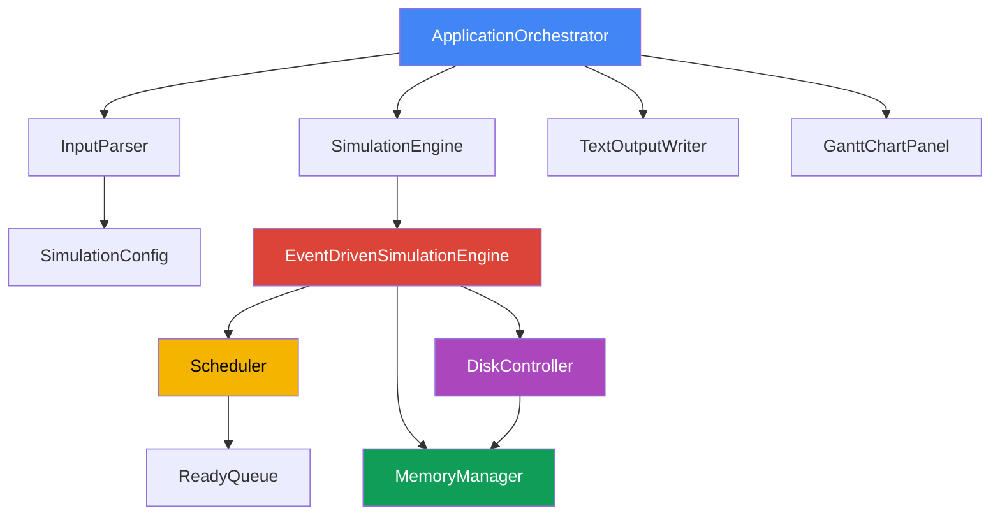
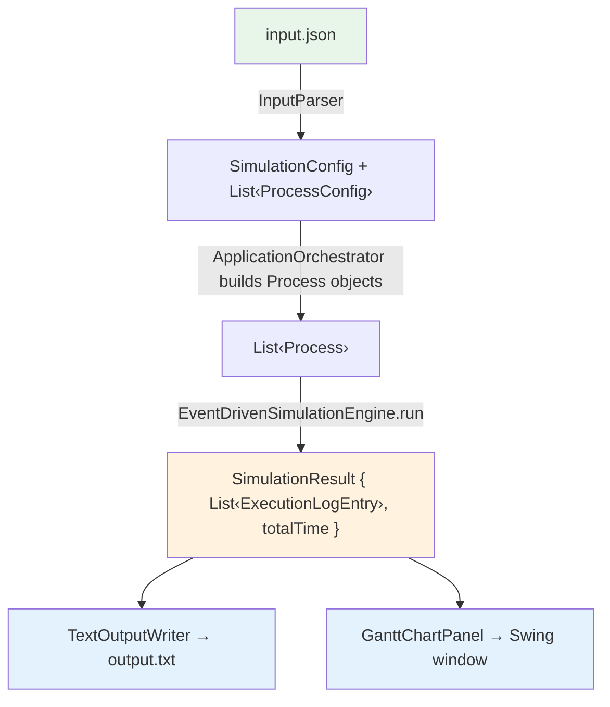
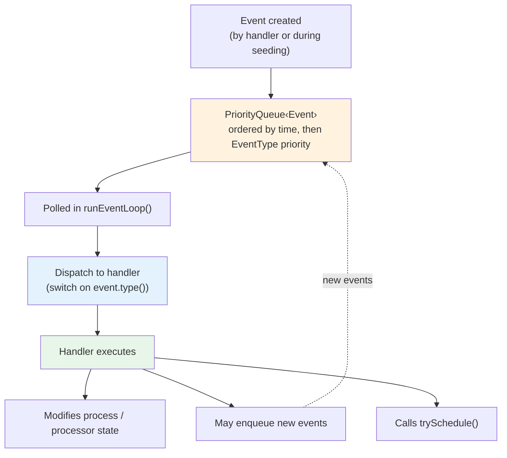
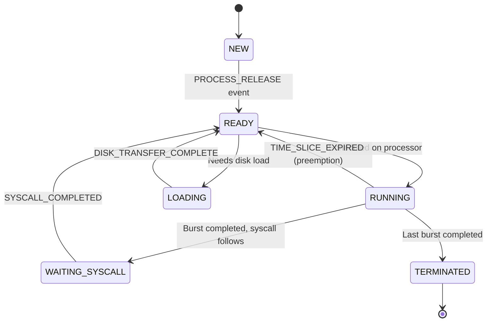
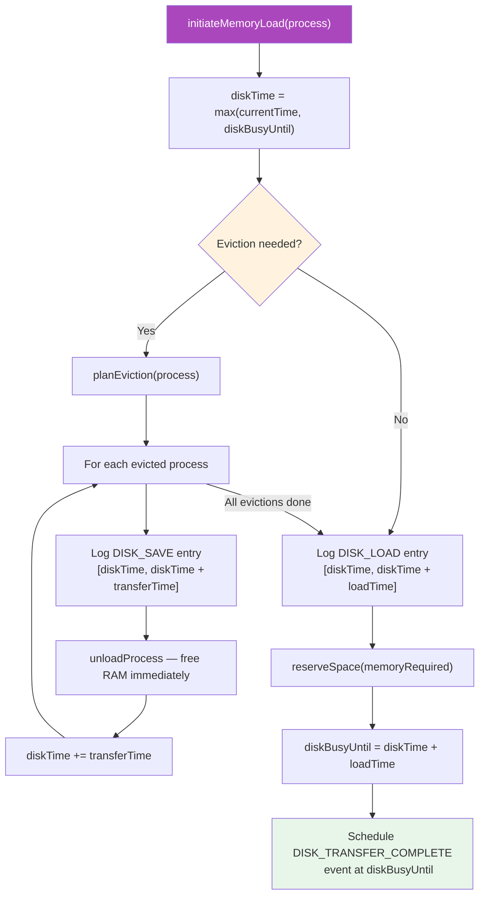

# ScheduleSim — Architecture & Semantics Documentation

This document describes the internal architecture, design semantics, and invariants of the ScheduleSim operating system process scheduling simulator. It complements the project README by focusing on **why** the system is built the way it is and **what contracts** each component upholds.

---

## Table of Contents

1. [System Overview & Simulation Model](#system-overview--simulation-model)
2. [Component Architecture](#component-architecture)
3. [Event System Semantics](#event-system-semantics)
4. [Process State Machine](#process-state-machine)
5. [Scheduling Semantics](#scheduling-semantics)
6. [Memory Subsystem](#memory-subsystem)
7. [Disk I/O Model](#disk-io-model)
8. [Validation & Error Handling](#validation--error-handling)
9. [Class Responsibility Summary](#class-responsibility-summary)

---

## 1. System Overview & Simulation Model

### What is being simulated

ScheduleSim models a multi-processor operating system with:
- **N configurable CPUs** executing user processes concurrently
- **Limited RAM** requiring virtual memory with disk swapping
- A **dedicated system process** that handles syscalls on behalf of user processes
- **Preemptive Round-Robin scheduling** with equal priority for all user processes

The simulation accepts a JSON configuration describing the hardware parameters and a list of processes (each with a release time, memory footprint, and an alternating sequence of CPU bursts and syscall requests). It produces a complete execution trace as both a text log and a Gantt chart.

### Why discrete event-driven simulation

The simulator uses a **discrete event-driven** model rather than a time-stepped approach. The key differences:

| Aspect | Time-Stepped | Event-Driven (our choice) |
|--------|-------------|--------------------------|
| Advances by | Fixed time increments (Δt = 1) | Jumping to the next event's timestamp |
| Idle time | Must iterate through every idle unit | Skips directly over idle periods |
| Complexity | O(T) where T = total simulation time | O(E) where E = number of events |
| Determinism | Trivially deterministic | Deterministic given a stable event ordering |

The event-driven approach is particularly well-suited because the simulation has long idle periods (e.g., waiting for disk transfers, waiting for the system process period) interspersed with bursts of activity. Stepping through each time unit would waste computation.

### Simulation contract

- **Deterministic**: Given the same input, the simulation always produces the same output. This is guaranteed by the stable ordering of the event priority queue (time-first, then event-type priority for ties).
- **Single-threaded**: The entire simulation runs in a single thread. There is no concurrency — the event loop processes one event at a time, which simplifies reasoning about state.
- **Time-advancing**: `currentTime` never decreases. Events are processed in non-decreasing time order. Multiple events at the same timestamp are processed in priority order.

---

## 2. Component Architecture

### Dependency graph



### Separation of concerns

Each component owns a specific slice of simulation state and makes decisions only within its domain:

| Component | Owns | Decides |
|-----------|------|---------|
| `EventDrivenSimulationEngine` | Event queue, current time, syscall queue, log entries | Event dispatch order, when to call `trySchedule()` |
| `Scheduler` | Ready queue | Which process goes on which processor (affinity + FIFO) |
| `MemoryManager` | Memory accounting (used, reserved, loaded map) | Which processes to evict (LRU), whether a load is feasible |
| `DiskController` | Disk timeline (`diskBusyUntil`) | When disk operations start/end, sequencing saves before loads |
| `Processor` | Current process assignment, system-process occupancy | Nothing — it's a passive state holder |

The engine **orchestrates** the other components but does not duplicate their logic. For example, the engine calls `scheduler.scheduleReadyProcesses()` and uses the returned `SchedulingDecision` list — it never looks into the ready queue directly.

### Data flow



---

## 3. Event System Semantics

### Event lifecycle



Events are **immutable records** — once created, they cannot be modified. This means an event cannot be "cancelled." Instead, handlers use **guard checks** to detect and ignore stale events.

### Event ordering contract

The `Event` record implements `Comparable<Event>` with a two-level ordering:

1. **Primary**: `time` (ascending) — earlier events first
2. **Secondary**: `EventType.priority` (ascending) — lower priority value = processed first

This ordering is critical for correctness. When multiple events fire at the same timestamp, the processing order determines the simulation outcome.

### Priority rationale

| Priority | Event Type | Why this priority? |
|----------|-----------|-------------------|
| 1 | `PROCESS_RELEASE` | New processes should enter the ready queue before any scheduling decisions are made at this timestamp, so they can be considered in the same round. |
| 2 | `SYSTEM_PROCESS_COMPLETED` | The system process freeing a processor should happen before other completions, so the freed CPU is available for user processes. |
| 3 | `BURST_COMPLETED` | A process finishing its burst frees a CPU and may produce a syscall — this should happen before preemption events. |
| 4 | `TIME_SLICE_EXPIRED` | Preemption should be processed after completions. If a burst was completed at exactly the time slice boundary, the completion takes precedence (the process is done, not preempted). |
| 5 | `SYSCALL_COMPLETED` | Processes returning from syscall wait should re-enter the ready queue after CPU freeing events, so they can be scheduled in the same `trySchedule()` round. |
| 6 | `SYSTEM_PROCESS_RELEASE` | The periodic system process release should happen after all CPU-related events at this time, as it needs to assess the current state of the syscall queue. |
| 7 | `DISK_TRANSFER_COMPLETE` | Disk completions are lowest priority — they add processes to the ready queue last, after all CPU events at this time are settled. |

### Stale event handling

Because events cannot be cancelled, the engine must handle the case where an event refers to a state that has already changed. Two specific guards:

**`handleTimeSliceExpired`**: Checks that the process is still `RUNNING` and still on the expected processor. If the process was already moved (e.g., burst completed at exactly the same time), the event is silently ignored.

```java
if (process.getState() != ProcessState.RUNNING || processor.getCurrentProcess() != process) {
    return;  // Stale event — process already moved
}
```

**`handleBurstCompleted`**: Same guard — if the process is no longer running on the expected processor, the event is stale.

This pattern avoids the need for an event cancellation mechanism, keeping the priority queue simple and efficient.

---

## 4. Process State Machine

### State transitions



### Transition triggers

| From | To | Trigger | Handler |
|------|----|---------|---------|
| `NEW` | `READY` | `PROCESS_RELEASE` event fires at release time | `handleProcessRelease` |
| `READY` | `RUNNING` | Scheduler assigns process to a free processor | `dispatchProcessOnProcessor` |
| `RUNNING` | `READY` | Time slice expired (preemption) | `handleTimeSliceExpired` |
| `RUNNING` | `WAITING_SYSCALL` | Burst completed, syscall follows | `handleBurstCompleted` |
| `RUNNING` | `TERMINATED` | Last burst completed, no more work | `handleBurstCompleted` |
| `WAITING_SYSCALL` | `READY` | System process executed the syscall | `handleSyscallCompleted` |
| `READY` | `LOADING` | Scheduler needs to load process from disk | `DiskController.initiateMemoryLoad` |
| `LOADING` | `READY` | Disk transfer complete | `handleDiskTransferComplete` |

### State invariants

| State | Invariants |
|-------|-----------|
| `NEW` | Process exists but has not been released. Not in ready queue. Not in memory. |
| `READY` | Process is in the ready queue (or about to be added). May or may not be in memory. |
| `RUNNING` | Exactly one processor has this process as `currentProcess`. Process is loaded in memory. `lastProcessorId` matches the current processor. |
| `WAITING_SYSCALL` | Process has a pending `SystemCallRequest` in the syscall queue. Not on any processor. Still loaded in memory (was running just before). |
| `LOADING` | A disk transfer is in progress for this process. Memory has been reserved via `reserveSpace()` but not yet committed. Cannot be evicted. |
| `TERMINATED` | All bursts completed. Memory has been freed (if was loaded). No further events will affect this process. |

---

## 5. Scheduling Semantics

### When scheduling occurs

`trySchedule()` is called after **every state-changing event handler**:
- `handleProcessRelease` — new process available
- `handleTimeSliceExpired` — processor freed, process back in queue
- `handleBurstCompleted` — processor freed, process may have terminated or entered syscall wait
- `handleSyscallCompleted` — process back in ready queue
- `handleSystemProcessCompleted` — processor freed from system process duty
- `handleDiskTransferComplete` — process now in memory and ready

This ensures no scheduling opportunity is missed.

### Ready queue FIFO contract

The `ReadyQueue` is a `LinkedList`-backed FIFO queue. Processes are always added to the tail and consumed from the head. This guarantees fairness — a process that has been waiting longer gets scheduled first, all else being equal.

### Two-pass scheduling design

`trySchedule()` uses a deliberate two-pass approach:

**Pass 0 — System process priority**: If the system process is waiting for a CPU (`systemProcessWaiting == true`) and there are pending syscalls, it gets the first available processor. This implements the higher-priority requirement.

**Pass 1 — In-memory scheduling**: The scheduler iterates through the ready queue looking for processes that are **already loaded in memory**, pairing them with free processors. This pass can produce multiple `SchedulingDecision` objects in a single call (e.g., 3 ready in-memory processes and 3 free CPUs → 3 assignments).

**Pass 2 — Disk load initiation**: If there are still ready processes that are **not in memory**, the engine dequeues **exactly one** and initiates a disk load via the `DiskController`.

**Why only one disk load at a time?** The disk is a single serial channel. Initiating multiple loads would just queue them on the disk timeline. More importantly, by doing only one at a time, we allow the disk-transfer-complete event to trigger a fresh `trySchedule()` call, which can re-evaluate the situation (maybe by then, the process is no longer needed, or a higher-priority action is available).

### Processor affinity semantics

When multiple processors are free, `Scheduler.findBestProcessor()` prefers the one matching `process.getLastProcessorId()`. This models CPU cache affinity — in a real system, the process's data may still be in the L1/L2 cache of the processor it last ran on.

The affinity is a **soft preference**, not a hard constraint:
- If the preferred processor is busy, any free processor is used.
- If the process has never run before (`lastProcessorId == -1`), the first free processor is chosen.
- The system process has **no affinity** — it uses `findFreeProcessor()` which picks any free CPU.

### System process scheduling

The system process operates on a different contract than user processes:

1. **Periodic release**: Strictly periodic at multiples of `systemProcessPeriod`. The next release is always `nextSystemProcessReleaseTime += period` — never relative to the current time, so there is no drift.
2. **Higher priority**: When waiting for a CPU, the system process is checked **before** user process scheduling in `trySchedule()`.
3. **Uninterrupted execution**: Once it gets a processor, it drains **all** pending syscalls back-to-back without yielding. It is not subject to the Round-Robin time slice.
4. **Completion**: After executing all syscalls, it releases the processor via `SYSTEM_PROCESS_COMPLETED`.

The specification states the system process period is "much longer than the scheduling time slice," so any instance has enough time to complete before the next release.

---

## 6. Memory Subsystem

### Memory accounting invariant

At all times, the following invariant holds:

```
usedMemory + reservedMemory + freeMemory == totalMemory
```

Where:
- `usedMemory` = sum of `memoryRequired` for all fully-loaded (committed) processes
- `reservedMemory` = sum of `memoryRequired` for all in-flight disk loads (reserved but not yet committed)
- `freeMemory` = `totalMemory - usedMemory - reservedMemory`

### Reserve / Commit protocol

The two-phase memory protocol exists to prevent **double-booking**. Consider this scenario without it:

```
Time 10: Disk starts loading P3 (needs 40 units). Free memory = 50.
Time 10: trySchedule() runs again. Free memory still appears to be 50.
Time 10: Disk starts loading P4 (needs 30 units). But actual free will be only 10 after P3 loads!
```

With the reserve/commit protocol:
```
Time 10: reserveSpace(40) for P3. Free = 50 - 40 = 10.
Time 10: P4 needs 30, but free = 10. Cannot load — correctly blocked.
Time 15: commitLoad(P3). reserved -= 40, used += 40. Free = 10.
```

### LRU eviction semantics

"Last used time" is defined as the **most recent timestamp at which the process was dispatched onto a processor** (set in `dispatchProcessOnProcessor` via `memoryManager.updateLastUsedTime()`).

The eviction algorithm (`planEviction`):
1. Collects all loaded processes with their last-used times.
2. Sorts by last-used time ascending (least recently used first).
3. Skips any process in `RUNNING` or `LOADING` state — these **cannot** be evicted because:
   - `RUNNING`: The process is actively executing on a CPU. Evicting it would corrupt the simulation.
   - `LOADING`: Memory is already reserved for this process. Evicting it mid-transfer is undefined.
4. Accumulates candidates until enough memory can be freed.
5. Returns the eviction plan as an `EvictionResult` (list of processes + total disk save time).

### Feasibility check

Before initiating a load, `canFreeEnoughMemory()` checks whether it's **theoretically possible** to free enough space. This prevents initiating a load that would fail mid-way. The check sums up all evictable memory (excluding `RUNNING` and `LOADING` processes) and compares against the deficit.

### Cross-validation

At configuration time, `SimulationConfig` validates that no individual process requires more memory than the total system memory. This prevents a situation where a process can **never** be loaded, which would cause the simulation to loop forever (the process stays in the ready queue permanently, and `SYSTEM_PROCESS_RELEASE` events keep firing indefinitely).

---

## 7. Disk I/O Model

### Single-channel sequential disk

The disk is modeled as a single serial resource. All operations — both saves (evictions) and loads — pass through the same channel. This means:

- If the disk is currently busy (e.g., saving an evicted process), a new load must **wait** until the current operation finishes.
- Multiple saves followed by a load are executed **sequentially** on the disk timeline.

### Disk timeline independence

The disk has its own timeline variable `diskBusyUntil`, completely independent from `currentTime` (the CPU timeline). This independence is what makes disk I/O **non-blocking** for processors:

```mermaid
gantt
    title CPU and Disk Timelines (parallel operation)
    dateFormat X
    axisFormat %s

    section CPU 0
    P1 runs           :active, 0, 8

    section CPU 1
    P2 runs            :active, 2, 10

    section Disk
    Save P4            :crit, 1, 4
    Load P3            :crit, 4, 8
```



The only synchronization point is the `DISK_TRANSFER_COMPLETE` event, which is scheduled on the **event queue** at the disk's completion time. When that event fires, the process transitions to `READY` and CPU scheduling re-evaluates.

### Eviction + Load as an atomic sequence

When `DiskController.initiateMemoryLoad()` is called, it performs a single atomic sequence on the disk timeline:



Note that evicted processes' memory is freed **immediately** (not at the end of the save), because the simulation models the eviction as "the in-memory copy is discarded, and the disk copy is the authoritative version." The save operation is writing to disk, not reading from it — the memory can be reclaimed as soon as the decision is made.

### One-load-at-a-time policy

The engine initiates at most **one** disk load per `trySchedule()` invocation (Pass 2). Rationale:

1. **Simplicity**: A single in-flight load is easy to reason about. No need to track multiple concurrent reservations.
2. **Responsiveness**: After the load completes, `trySchedule()` re-evaluates. The world may have changed — a different process might now be more urgently needed.
3. **Fairness**: CPU events that occur during the transfer get processed normally and can trigger new scheduling decisions.

---

## 8. Validation & Error Handling

### Input validation (fail-fast at startup)

Configuration records use **`IllegalArgumentException`** for invalid input — these are always active, regardless of JVM flags:

**`SimulationConfig`**:
- Processors, memory, time slice, system process period, disk transfer rate must all be positive
- Process list must not be null or empty
- **Cross-validation**: No process may require more memory than `memorySize`

**`ProcessConfig`**:
- Name must not be null or empty
- Release time must be non-negative
- Memory required must be positive
- Execution sequence must be non-null, non-empty, and have an **odd** number of elements (alternating bursts and syscalls)

**`Process` constructor**:
- Validates execution sequence values are all positive

### Runtime invariant checking (defensive programming)

The engine uses **`IllegalStateException`** for invariant violations at runtime:

- Every event handler validates that its required fields (`process`, `processor`) are non-null
- `dispatchProcessOnProcessor` checks that the processor is free before assignment
- These checks catch programming errors (bugs in the engine logic) rather than input errors

---

## 9. Class Responsibility Summary

| Class | Package | Type | Owns | Decides | Produces |
|-------|---------|------|------|---------|----------|
| `Main` | root | Entry point | Nothing | Input file path | — |
| `ApplicationOrchestrator` | root | Orchestrator | Pipeline wiring | Component creation order | — |
| `InputParser` | config | Parser | Jackson `ObjectMapper` | — | `SimulationConfig` |
| `SimulationConfig` | config | Record | Global parameters | Input validation | — |
| `ProcessConfig` | config | Record | Per-process parameters | Input validation | — |
| `EventDrivenSimulationEngine` | engine | Engine | Event queue, current time, syscall queue, log entries | Event dispatch, when to schedule | `SimulationResult` |
| `Scheduler` | scheduler | Scheduler | `ReadyQueue` | Process-to-processor assignment, affinity | `List<SchedulingDecision>` |
| `MemoryManager` | memory | State tracker | Loaded processes map, memory accounting | LRU eviction planning, feasibility checks | `EvictionResult` |
| `DiskController` | memory | I/O manager | `diskBusyUntil` timeline | Disk operation sequencing | `ExecutionLogEntry` (disk ops) |
| `Process` | model.process | Entity | State, burst tracking, `lastProcessorId` | — (passive) | — |
| `Processor` | model.simulation | Entity | Current process, system-process flag | — (passive) | — |
| `ReadyQueue` | model.simulation | Data structure | FIFO queue of processes | — | — |
| `Event` | model.event | Record | Time, type, process ref, processor ref | Comparison ordering | — |
| `ExecutionLogEntry` | model.simulation | Record | Label, processor, time range, entry type | — | — |
| `SimulationResult` | model.simulation | Record | Log entries, total time | Filtering (per-processor, disk) | — |
| `TextOutputWriter` | output | Writer | — | Output formatting | `output.txt` file |
| `GanttChartPanel` | ui | View | Color assignments, layout constants | Rendering layout | Swing window |

---

## Appendix: Glossary

| Term | Definition |
|------|-----------|
| **Release time** | The simulation time at which a process is created (launched). From this point, the OS considers it for scheduling. |
| **Burst** | A contiguous interval of CPU execution for a process. Cannot be split across processors — must run on one CPU (though it may be preempted by the time slice). |
| **Syscall** | A system call requested by a user process. Executed by the system process, not the user process itself. |
| **Time slice** | The maximum continuous execution time a user process gets before being preempted (Round-Robin quantum). |
| **Affinity** | The preference for scheduling a process on the processor it most recently ran on (soft preference). |
| **Eviction** | Removing a process from RAM and saving it to disk to free memory for another process. |
| **LRU** | Least Recently Used — the eviction policy. The process with the oldest `lastUsedTime` is evicted first. |
| **diskBusyUntil** | The timestamp at which the disk becomes free for new operations. All disk ops are sequenced after this point. |
| **Reserve / Commit** | Two-phase memory protocol: `reserveSpace` when disk load starts, `commitLoad` when transfer completes. |
